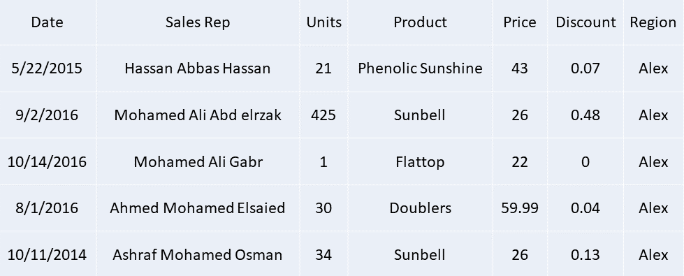
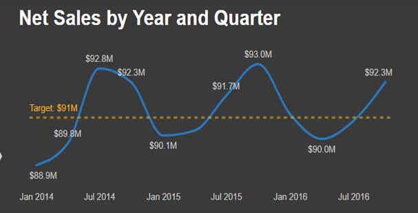
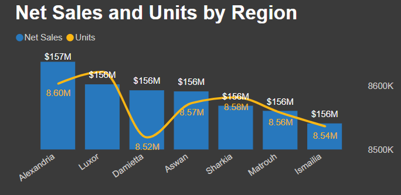
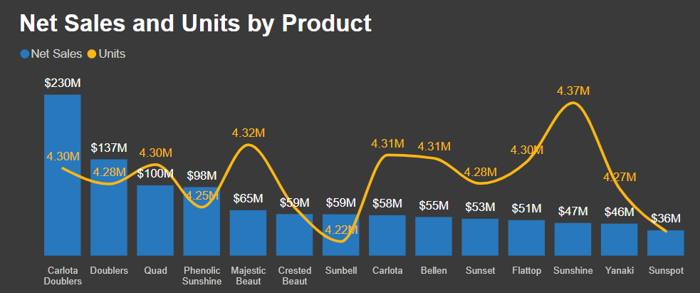
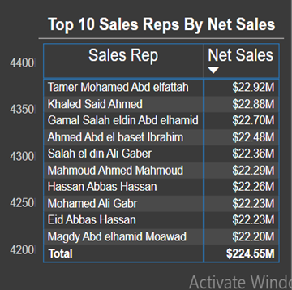

# Overview
  An analysis made on 50K of sales transactions through 5 regions in Egypt, understanding the flow over 3 years & what drives the market.
  
  For data source click her: [Sales Data](/Source_Data/)

  Short video on Linkedin: https://bit.ly/3WQ5XBZ

# Data Sample

# Tools Used
  * Power BI
  * Power Query

# The Analysis

  ### 1. Net Sales by Year & Quarter
  
  Calculated the Net Sales through DAX to have an overview through the years & putting imaginary target at 91M to have a better perspective.

  
  
  ### 2. Net Sales & Units by Region

  To determine the highest demanding & most profitable region.
  
  
  
  ### 3. Net Sales & Units by Product

  To Identify which product is the most selling and which has the highest Net Sales.
  
  
  
  ### 4. Top 10 Sales Reps

  To showcase of the Sales Reps that got the highest Net Sales over the 3 years in order to give them a bonus.
  
  

  # Insights

  #### 1. There is a Drop in every 1st 2 Qtrs. in each year so need to dig deeper to validate these drops.
  #### 2. A recommendation for the company to reduce cost it might consider removing a product like "Sunshine" 
  as it has the highest sold units with a relatively low Net Sales or sales can be increased by increasing its price.
  #### 3. Next in action is to extract the Bottom 10 Sales Reps and look for ways of improvements.
